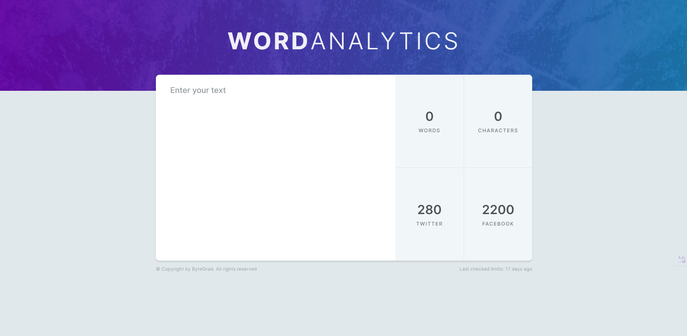

# ByteGrad JS Course - Word Analytics

This is a solution to the [ByteGrad Word Analytics Project](https://bytegrad.com/courses/professional-javascript).

## Table of contents

- [Overview](#overview)
  - [Screenshot](#screenshot)
  - [Links](#links)
- [My process](#my-process)
  - [Built with](#built-with)
  - [What I learned](#what-i-learned)
  - [Continued development](#continued-development)

## Overview

### Screenshot

### Links

- Solution URL: [Github repo link](https://github.com/blanKTcup/Word-Analytics)
- Live Site URL: [Live site link](https://kt-word-analytics.netlify.app/)

## My process

### Built with

- Semantic HTML5 markup
- Flexbox
- SASS/SCSS
- JS ES6
- BEM

### What I learned

Initially, I tried to complete this project using CSS grid but this was a mistake. I learned that a mobile-first-workflow would have prevented this and that even if you could use CSS grid for something, you should consider future designs that may not work with grid for example. I learned how to style textarea in html. I learned more about accessibility and responsive design not by building the project itself but by getting feedback from my mistakes and setting new goals to learn more about the correct things that I should be doing.

### Continued development

I want to keep learning about responsive design without media queries, mobile first workflow, accessibility with aria and other related things
